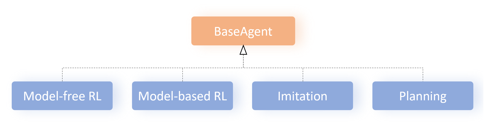
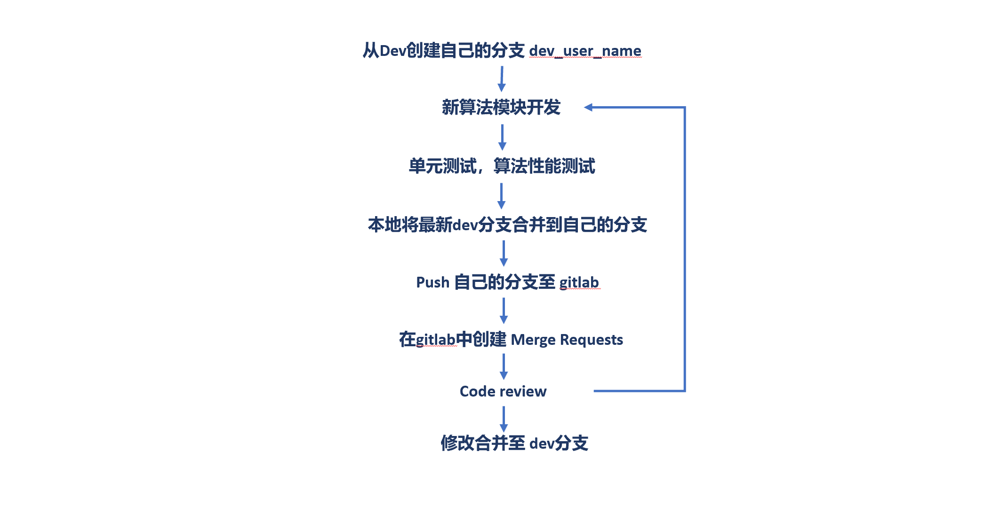

Developer Guide
=================

Add RL Algorithm
------------------

The working directory of the RL algorthm module is ``d2c/models``. There are several subfolders to classify the RL algorithms. All the algorithms are inherited from the base class :class:`~d2c.models.base.BaseAgent`. The relationship between the ``BaseAgent`` and the different classes RL algorithms is shown in figure below:

Know the ``BaseAgent``
^^^^^^^^^^^^^^^^^^^^^^^^^^
The system provides the algorithm base class to abstract some essential methods in the algorithm developing, including:

- ``__init__``: there are some essential parameters of the RL algorithms, like ``batch_size``, ``discount``... The detail information of the parameters can be found in doc string of the base class :class:`~d2c.models.base.BaseAgent`. Besides the parameters configuration, It calls two methods to build the networks and some other elements of the algorithm:

  - ``_get_modules``: please see below for details.

  - ``_build_agent``: please see below for details.

- ``_get_modules``: it likes a factory that provides the functions to produce the network models of the algorithm, like actor and Q net. It uses the input ``model_params`` and the network classes in the module :module:`~d2c.utils.networks` to build the network factories. You can add some new networks in :module:`~d2c.utils.networks` as needed.

- ``_build_agent``: it calls some methods of itself to build networks, optimizers, and some Dicts to store the training information and testing policies.

  - Please see below for details of these methods.

- ``_build_fns``: it first uses the class :class:`~d2c.models.base.BaseAgentModule` to build all the network models of the RL algorithm.

  - ``BaseAgentModule``: it is a base class in the module :module:`~d2c.models.base`. In your algorithm module, you should inherit it to build the class ``AgentModule`` of your algorithm. Its initialization parameter ``modules`` is come from the result of the above method :meth:`~d2c.models.base.BaseAgent._get_modules`. Its method :meth:`~d2s.models.base.BaseAgentModule._build_modules` builds the models of the algorithm according to the input network factories. You should implement this method in your ``AgentModule`` class.

  - We get the attribute ``_agent_module`` by instantiating the class ``AgentModule``. Then you can build some attributes as the reference of the network models in ``_agent_module`` for convenience.

- ``_init_vars``: Initializing some variables that will be used in training process of this algorithm.

- ``_build_optimizers``: the parameters for building the optimizers are in attribute ``_optimizers``. You can use the function :func:`~d2c.utils.utils.get_optimizer` to build all the optimizers needed with the parameters.

- ``_build_loss``: you may not have to implement this method. You should add some functions to build the ``loss`` as need in this algorithm, like ``_build_q_loss`` to build the loss for updating the Q net parameters or ``_build_p_loss`` to build the loss for updating the policy net parameters. The input of this func is a batch of data and the returns are the computed loss and some information that you want to print and store(like loss value etc.).

- ``_get_train_batch``: sample a batch of transitions from the training data set.

- ``_optimize_step``: it builds the optimizing schedule for the algorithm. Before implement this method, you should add the methods to optimize the network models in the algorithm, like ``_optimize_q`` and ``_optimize_p`` to build loss and optimize the Q net and policy net for one step respectively. In method  ``_optimize_step``, you can use the defined optimize functions above to implement the algorithm. You can also update the target network here and collect the returned training information of each optimizing function.

- ``train_step``: this is the main API of the algorithm class. It has been defined in advance. Calling it to implement one step training of the algorithm.

- ``_update_target_fns``: it updates the parameters of the target network. The inputs are the pair of the source network(``torch.nn.Module``) and the target network(``torch.nn.Module``).

- ``print_train_info``: it is an API for calling to print the training information in training process.

- ``write_train_summary``: it is an API for calling to log the training information using Tensorboard or Wandb.

- ``_build_test_policies``: it builds the policy for testing using the class in module :module:`~d2c.utils.policies`. You can add new class in :module:`~d2c.utils.policies` as needed.

- ``save``: Call this API to save the trained models. You can save all the models of the algorithm as an entirety by saving the attribute ``_agent_module``. You can also respectively save the every model of the algorithm.

- ``restore``: Call this API to restore the trained models of the algorithm.

Implement ``YOUR_ALGORITHM.py``
^^^^^^^^^^^^^^^^^^^^^^^^^^
Inherit the base class :class:`~d2c.models.base.BaseAgent` and follow the following steps to add a new algorithm. **You can take the module td3_bc in d2c/models/model_free as reference.**

1. Determine the type of the algorithm and choose a folder in ``d2c/models`` to place the algorithm module file. The file should be named after the name of the algorithm, like ``td3_bc.py``.

2. Named the algorithm class as ``xxxAgent``.

3. Implement the method ``__init__``. Determine the specific parameters of the algorithm and class attributes.

4. Implement the method ``_get_modules``. The attribute ``_model_params`` can refer to ``model.td3_bc.hyper_params.model_params`` in file ``example/benchmark/config/model_config.json5``. Then you can define the network factories.

5. Implement the class ``AgentModule`` by inheriting the class :class:`~d2c.models.base.BaseAgentModule`. In this class, you can build all the network models needed in the algorithm.

6. Implement the methods ``_build_fns``, ``_build_optimizers``. In ``_build_optimizers``, the attribute ``_optimizers`` can refer to ``model.td3_bc.hyper_params.optimizers`` in file ``example/benchmark/config/model_config.json5``.

7. Implement the methods ``_build_xxx_loss``, ``_optimize_xxx``, ``_optimize_step`` according to the algorithm for optimizing the network models in the algorithm.

8. Implement the methods ``_build_test_policies``, ``save``, ``restore``.

Configurate your algorithm
^^^^^^^^^^^^^^^^^^^^^^^^^^
1. Complete module :module:`~d2c.models.__init__`. Import the new algorithm module here and update the dict ``AGENT_MODULES_DICT`` to add the new module. The key of the dict is the name of the algorthm.

2. Complete the configuration file ``example/benchmark/config/model_config.json5``. Add the model parameters dict in ``model``. Refer to ``model.td3_bc``.

Test your algorithm
^^^^^^^^^^^^^^^^^^^^^^^^^^

Unittest
.............
- Add the unittest of the new algorithm in folder ``test/models/xxx``. Refer to ``test/models/model_free/test_td3_bc.py``.

- If you add some other new modules, classes or functions(like the new network class or policy class), please add their unittests in the property folders.

Test on benchmark
...............
After the unittest, you should test the new algorithm on the benchmark to verify its performance.

- Add a demo file ``demo_xxx.py`` in folder ``example/benchmark`` referring to ``example/benchmark/demo_td3_bc.py``.

- You can also add a shell script to run the experiments. Refer to ``example/benchmark/run.sh``.

- Please save the training information and the evaluation results. You can put the evaluation results in folder ``example/benchmark/results``. Refer to the results of  ``td3_bc`` in that folder.

Considerations
^^^^^^^^^^^^^^^^^^^^^^^^^^

Code style(PEP8)
.................
Please unify the code style referring to this repository. Refer to style guide PEP8_.

.. _PEP8: https://pep8.org/

Annotations(doc strings)
................
Add the doc strings to the new modules, class, method and function to explain their meaning and use. Refer to the `Docstring Conventions <https://peps.python.org/pep-0257/>`_.

Type annotations
.................
Add the Type Annotations for the parameters of the functions and the class methods. Refer to `this link <https://www.dusaiphoto.com/article/164/>`_.

Develop workflow
.................
When collaborating to develop the algorthm using Git, you may refer to the develop workflow as below:

