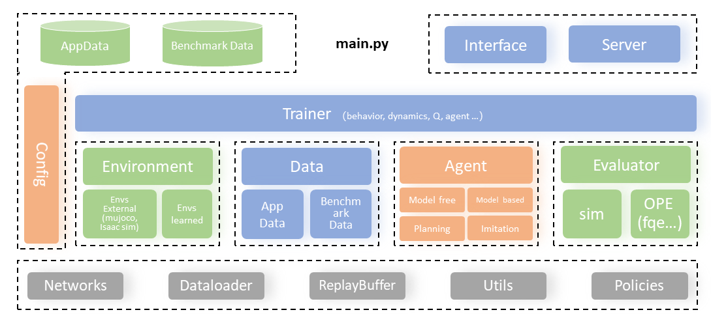

.. D2C documentation master file, created by
   sphinx-quickstart on Thu Sep  8 19:20:49 2022.
   You can adapt this file completely to your liking, but it should at least
   contain the root `toctree` directive.

Welcome to D2C's documentation!
===============================

D2C(**D**\ ata-\ **d**\ riven **C**\ ontrol Library) is a library for data-driven decision-making & control based on state-of-the-art offline reinforcement learning (RL), offline imitation learning (IL), and offline planning algorithms. It is a platform for solving various decision-making & control problems in real-world scenarios. D2C is designed to offer fast and convenient algorithm performance development and testing, as well as providing easy-to-use toolchains to accelerate the real-world deployment of SOTA data-driven decision-making methods.

The overall framework of D2C is as below:

The current supported offline RL/IL algorithms include (**more to come**):

* :class:`~d2c.models.TD3BCAgent` `TD3+BC <https://arxiv.org/pdf/2106.06860.pdf>`_

* :class:`~d2c.models.DOGEAgent` `DOGE <https://arxiv.org/abs/2205.11027.pdf>`_

* :class:`~d2c.models.H2OAgent` `H2O <https://arxiv.org/abs/2206.13464.pdf>`_

* :class:`~d2c.models.IQLAgent` `IQL <https://arxiv.org/pdf/2110.06169.pdf>`_

* :class:`~d2c.models.DMILAgent` `DMIL <https://arxiv.org/abs/2207.00244>`_

* :class:`~d2c.models.BCAgent` `BC <http://www.cse.unsw.edu.au/~claude/papers/MI15.pdf>`_

Here are other features of D2C:

* D2C includes a large collection of offline RL and IL algorithms: model-free and model-based offline RL/IL algorithms, as well as planning methods.

* D2C is highly modular and extensible. You can easily build custom algorithms and conduct experiments with it.

* D2C automates the development process in real-world control applications. It simplifies the steps of problem definition/mathematical formulation, policy training, policy evaluation and model deployment.

Installation
------------
D2C interface can be installed as follows:

.. code-block:: bash

    $ git clone https://github.com/AIR-DI/D2C.git
    $ cd d2c
    $ pip install -e .

.. toctree::
   :maxdepth: 1
   :caption: Tutorials

   tutorials/getting_started
   tutorials/overview
   tutorials/create_dataset
   tutorials/customize_environment
   tutorials/developer
   tutorials/configuration

.. toctree::
   :maxdepth: 1
   :caption: API Docs

   api/d2c.data
   api/d2c.envs
   api/d2c.evaluators
   api/d2c.models
   api/d2c.trainers
   api/d2c.utils

.. toctree::
   :maxdepth: 1
   :caption: Community

   contributor

Indices and tables
----------------------

* :ref:`genindex`
* :ref:`modindex`
* :ref:`search`
