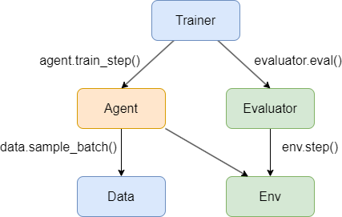

Overview
=========

We will help you understand the software design of D2C.
All important components in D2C will be introduced.

Code Structure
----------------
The overall framework of D2C is as below:

.. figure:: ../_static/images/overall_framework.png

D2C splits a Offline Reinforcement Learning agent training procedure into several parts: Data, Environment, Algorithm, Evaluator and Trainer. These components can be seen as above. The relations among these parts can be described as:

The Agent module implements the offline reinforcement learning algorithm that learns from the training data provided by the Data module and the environment information provided by the Environment module. The Evaluator module uses the Environment module to create a policy evaluation environment where the agent's performance can be measured. The Trainer module coordinates the training and evaluation of the agent using the Algorithm and Evaluator modules.

Data
-----
:class:`~d2c.data.Data` is responsible for providing the offline data that the offline reinforcement learning algorithm needs for training. The construction of the Data module involves two submodules: :class:`~d2c.utils.dataloader.BaseDataLoader` and :class:`~d2c.utils.replaybuffer.ReplayBuffer`. The Dataloader module imports the raw offline data and parses it into transitions data, which consists of observation, action, next observation, reward, done and other information. The transitions data are then stored in the ReplayBuffer module, which allows the algorithm to sample a batch of data from it during training.

One of the main features of the Dataloader module is that it can be customized to import offline data from different sources, such as benchmark datasets like D4RL (using :class:`~d2c.utils.dataloader.D4rlDataLoader`), or offline data from real-world scenarios saved in csv files (using :class:`~d2c.utils.dataloader.AppDataLoader`). If you want to customize the import of other benchmark datasets, you can inherit from :class:`~d2c.utils.dataloader.BaseBMLoader` and implement the relevant abstract methods. See more details in :doc:`./create_dataset`.

Environment
-------------
The Environment module has an interface that is consistent with the gym environment interface. The Environment module is mainly divided into two categories: :ref:`external <external-env-label>` and :ref:`learned <learned-env-label>`. The envs under external mainly construct the environment by accessing the perfect simulation of the outside world, such as mujoco environment, Isaac gym environment, etc. The external envs are mainly used for policy evaluation or direct participation in online RL training during the reinforcement learning algorithm training process. The envs under learned mainly construct a virtual simulation environment by loading a trained dynamics model (usually a neural network model). This type of env can generally be used in model-based RL algorithms and provide dynamics models, and can also provide the Agent with relevant information about the current environment's observation and action.

Algorithm
----------
The Algorithm module mainly contains four categories of offline reinforcement learning algorithms: imitation, model-based RL, model-free RL, and planning. All RL algorithms are obtained by inheriting from :class:`~d2c.models.base.BaseAgent` and implementing the relevant abstract methods. If you want to customize RL algorithms, please refer to :doc:`./developer`.

Evaluator
-----------
The Evaluator module is used to evaluate the trained policy during or after the RL algorithm training process. Here we provide two types of evaluation methods: based on simulator and using offline policy evaluation (OPE). The former uses the envs under external in the Environment module for evaluation, that is, a perfect simulation environment is required; the latter provides two offline policy evaluation methods, which are Fitted Q Evaluation (FQE) and Model-based off-policy evaluation.

.. code-block:: python

  from d2c.envs import benchmark_env
  from d2c.evaluators import bm_eval, make_ope
  # The env of the benchmark to be used for policy evaluation.
  env = benchmark_env(config=config, **s_norm)
  # The evaluator based on simulator.
  evaluator = bm_eval(agent=agent, env=env, config=config)
  trainer = Trainer(agent=agent, train_data=data, config=config, env=lea_env, evaluator=evaluator)
  trainer.train()
  # For FQE.
  fqe = make_ope('fqe', from_config=True, agent=agent, data=data, config=config)
  fqe.eval()
  # For model-based off-policy evaluation.
  lea_env = LeaEnv(config)
  lea_env.load()
  mb_ope = make_ope('mb_ope', from_config=True, agent=agent, data=data, env=lea_env, config=config)
  mb_ope.eval()

Trainer
------------
The Trainer module contains the process logic of RL model training. :meth:`~d2c.trainers.trainer._train_agent` is used to train the RL model, and there are also methods for separately training behavior, dynamics, Q function, etc. You can configure the ``train_schedule`` parameter of the corresponding algorithm in the configuration file ``model_config.json5`` to define the order of training the model after the training process is started. For example, if the ``train_schedule`` parameter of an algorithm named algo is ``['d', 'b', 'q', 'agent']``, then after calling the Trainer's train method, the model will be trained in the order of dynamics, behavior, Q, agent.

.. code-block:: python

  from d2c.trainers import Trainer
  from d2c.models import make_agent
  from d2c.envs import benchmark_env, LeaEnv
  from d2c.data import Data
  from example.benchmark.config import make_config

  config = make_config(kwargs)
  bm_data = Data(config)
  s_norm = dict(zip(['obs_shift', 'obs_scale'], bm_data.state_shift_scale))
  data = bm_data.data
  # The env of the benchmark to be used for policy evaluation.
  env = benchmark_env(config=config, **s_norm)
  # Contains dynamics model to be trained.
  lea_env = LeaEnv(config)
  agent = make_agent(config=config, env=lea_env, data=data)
  evaluator = bm_eval(agent=agent, env=env, config=config)
  trainer = Trainer(agent=agent, train_data=data, config=config, env=lea_env, evaluator=evaluator)
  trainer.train()