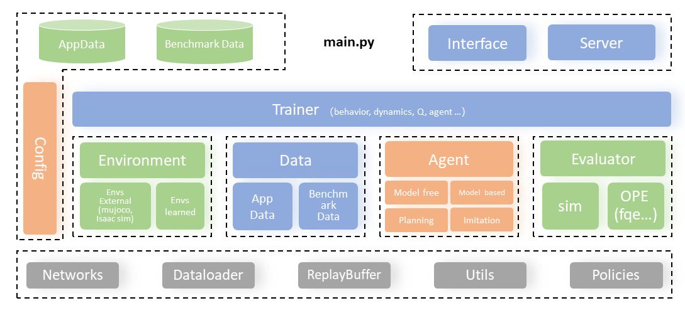

Overview
=========

We will help you understand the software design of D2C.
All important components in D2C will be introduced.

Code Structure
----------------
The overall framework of D2C is as below:

D2C splits a Offline Reinforcement Learning agent training procedure into several parts: Data, Environment, Algorithm, Evaluator and Trainer. These components can be seen as above. The relations among these parts can be described as:

.. figure:: ../_static/images/overview.png

Data
-----

Environment
-------------

Algorithm
----------

Evaluator
-----------

Trainer
------------

