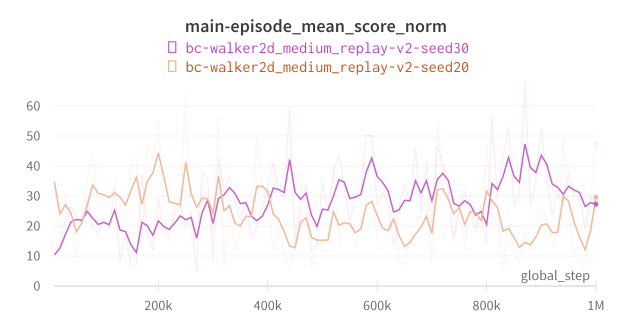

# Benchmark Results

Each image contains the results of the experiments with 2 different seeds.

## Hopper

### hopper_random-v2

### hopper_medium-v2

### hopper_medium_replay-v2

### hopper_medium_expert-v2

## HalfCheetah

### halfcheetah_random-v2

### halfcheetah_medium-v2

### halfcheetah_medium_replay-v2

### halfcheetah_medium_expert-v2

## Walker2d

### walker2d_random-v2

### walker2d_medium-v2

### walker2d_medium_replay-v2

### walker2d_medium_expert-v2

