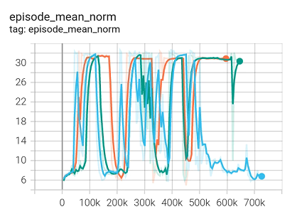

# Benchmark results
Each image contains the results of the experiments with 3 different seeds.
## Hopper
---
### hopper_random-v2

### hopper_medium-v2

### hopper_medium_replay-v2

### hopper_medium_expert-v2

## Halfcheetah
---
### Halfcheetah_random-v2

### Halfcheetah_medium-v2

### Halfcheetah_medium_replay-v2

### Halfcheetah_medium_expert-v2

## Walker2d
---
### Walker2d_random-v2

### Walker2d_medium-v2

### Walker2d_medium_replay-v2

### Walker2d_medium_expert-v2

